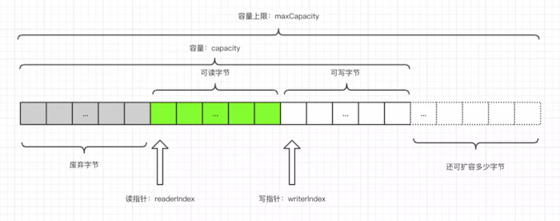

1. ByteBuf 是一个字节容器，容器里面的的数据分为三个部分，  
- 第一个部分是已经丢弃的字节，这部分数据是无效的；   
- 第二部分是可读字节，这部分数据是 ByteBuf 的主体数据， 从 ByteBuf 里面读取的数据都来自这一部分;   
- 最后一部分的数据是可写字节，所有写到 ByteBuf 的数据都会写到这一段。最后一部分虚线表示的是该 ByteBuf 最多还能扩容多少容量

2. 以上三段内容是被两个指针给划分出来的，从左到右，依次是读指针`readerIndex`、写指针`writerIndex`，
然后还有一个变量`capacity`，表示 ByteBuf 底层内存的总容量。

3. 从 ByteBuf 中每读取一个字节，`readerIndex` 自增1，
ByteBuf 里面总共有 writerIndex-readerIndex 个字节可读, 
由此可以推论出当 readerIndex 与 writerIndex 相等的时候，ByteBuf 不可读。

4. 写数据是从 `writerIndex` 指向的部分开始写，每写一个字节，writerIndex 自增1，直到增到 capacity，这个时候，表示 ByteBuf 已经不可写了。

5. ByteBuf 里面其实还有一个参数 `maxCapacity`，当向 ByteBuf 写数据的时候，如果容量不足，那么这个时候可以进行扩容，直到 capacity 扩容到 maxCapacity，超过 maxCapacity 就会报错...

